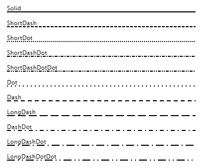
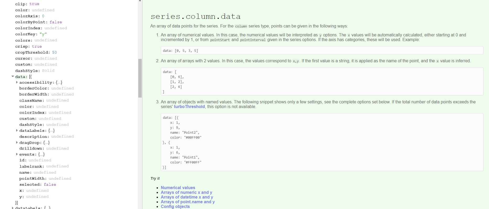
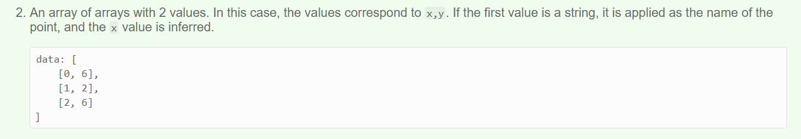
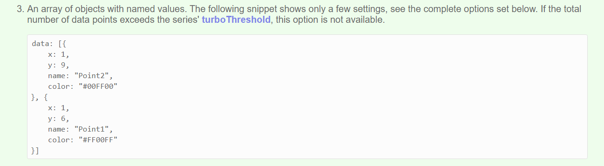

```{r setup, include=FALSE}

library(highcharter)
library(tidyverse)
library(ggplot2)
library(nbastatR)
library(forecast)
library(lubridate)
library(glue)
knitr::opts_chunk$set(echo = TRUE, warning = FALSE, message = FALSE)

# Some tibble options
options(
  tibble.width = Inf, 
  pillar.sigfig = 4,
  pillar.bold = TRUE
)
```

## Overview

### What

`highcharter` is an R implementation of the highcharts javascript graphing API through R's `htmlwidgets`. Most of the highcharts functionality is implemented through `highcharter` however the documentation is a little light. This guide will provide examples on how to create and customise various graphs whilst providing some tips on how to think about the package that will help you build and debug your more ambitious charts. I'll try to show and explain (to the best of my knowledge) the most common graphs and customisation options I use in my day-to-day work. I assume you're familiar with tidy data, dplyr, and R lists, as well as as simple understanding of the grammar of graphics (ggplot / `aes()`).

Highcharts is a commercial product so you can't add these charts to a commercial product (selling to customers) without purchasing a licence but non commercial use (internal organisation / research) comes under their free license.

Your most important resources should be the `highcharter` official website, and the highcharts API documentation which you should bookmark in your browser:

* [Highcharter Official Website](http://jkunst.com/highcharter/)
* [Highcharts API Documentation](https://api.highcharts.com/highcharts/)

Additionally get into styling your charts so a few extra resources you might want bookmarked:

* [coolors for selecting colors](https://coolors.co/app)
* [google fonts for selecting fonts](https://fonts.google.com/)

As you become more a more proficient `highcharter` user and your charting requirements become more complicated you will need to understand more about the complexities of the highcharts API and you might need to learn, read and write a little javascript. This learning curve is actually the best thing about highcharter: most basic charts are as easy to create as `ggplot`, whilst complex and beautiful charts are still achievable with enough thought and tinkering.

### When & Why

`highcharter` is a perfect compliment for `ggplot2`. Depending on your needs you it might not completely replace your use of that library, but it may. `ggplot` has a number of functional advantages over highcharter as it has simple implementations of reasonably complex chart types. I'd say I use `highcharter` for 90% of my day to day plots.

If you need to do any of the following or you're a gun at making ggplots look presentable it's I'd suggest using `ggplot`:
* Semi-complicated facetting
* Standard statistical layers / geoms like smooths and confidence intervals / error bars etc.

### Getting The Data

I'll be illustrating `highcharter` functionality with an NBA dataset I'll get from the `nbastatR` package.

We'll use the gamelogs (boxscores) from the most recent complete NBA season 2018-19:

```{r, warning=FALSE, message=FALSE}
gamelogs = game_logs(seasons = 2019)
```

## Basic Charts

### Tidy Data

Most (~90%) of your day-to-day charts can be probably written with 2-3 lines of code using the `hchart` and `hcaes` functions. These functions allow you to use the extremely powerful grammar of graphics to turn R data into interactive charts - functionality that isn't implemented natively in R `plotly` for example. Like `ggplot2` your data needs to be in tidy / long format so you'll often need to use `tidyr` for some simple data pivotting before passing it to your highchart functions.

A simple `ggplot` of the top 10 scorers in the NBA this year might look like the following:

```{r message=FALSE, warning=FALSE}
gamelogs %>%
  group_by(namePlayer) %>%
  summarise(ppg = mean(pts)) %>%
  arrange(desc(ppg)) %>%
  slice(1:10) %>%
  ggplot(aes(x = namePlayer, y = ppg)) +
  geom_col()
```

This chart, let's be honest here, looks awful. Ggplot needs to do a better job of creating pleasing default charts and themes to entice beginners. Ggplot has also chosen to alphabetize the players on the x-axis even though I specifically ordered the dataframe in descending points per game order, a reasonbaly challenging workaround is needed for an R beginner. Highcharter, on the other hand, creates readable, nice looking default charts that can be presented naturally in a widely used publishing format (a html page).

Here's the highcharter version of this plot which you'll notice feels extremely similar to above:

```{r}
gamelogs %>%
  group_by(namePlayer) %>%
  summarise(ppg = mean(pts)) %>%
  arrange(desc(ppg)) %>%
  slice(1:10) %>%
  hchart("column", hcaes(x = namePlayer, y = ppg))
```

This chart doesn't look that nice, but there's some notable format based advantages to the ggplot version:

* You can interact with it - hover over it to see a (relatively ugly) tooltip
* It's dynamic - reduce the width of your browser window to see the chart react and replot as it tries to estimate the best way to present the data without it looking busy and cluttered

### Chart Types

There are many chart types available in higcharts which you can see [here](https://api.highcharts.com/highcharts/series) however, I'll go through simple calls for the most common chart types.

#### Column

```{r}
gamelogs %>%
  group_by(namePlayer) %>%
  summarise(apg = mean(ast)) %>%
  arrange(desc(apg)) %>%
  slice(1:10) %>%
  hchart("column", hcaes(x = namePlayer, y = apg)) %>%
  hc_title(text = "Assists Per Game")
```

#### Bar

```{r}
gamelogs %>%
  group_by(namePlayer) %>%
  summarise(apg = mean(ast)) %>%
  arrange(desc(apg)) %>%
  slice(1:10) %>%
  hchart("bar", hcaes(x = namePlayer, y = apg)) %>%
  hc_title(text = "Assists Per Game")
```

#### Scatter

```{r}
gamelogs %>%
  group_by(namePlayer) %>%
  summarise(orebpg = mean(oreb), drebpg = mean(dreb), trebpg = mean(treb)) %>%
  arrange(desc(trebpg)) %>%
  slice(1:30) %>%
  hchart("scatter", hcaes(x = drebpg, y = orebpg)) %>%
  hc_title(text = "Off. Rebounds vs Def. Rebounds")
```

#### Bubble

```{r}
gamelogs %>%
  group_by(namePlayer) %>%
  summarise(orebpg = mean(oreb), drebpg = mean(dreb), trebpg = mean(treb)) %>%
  arrange(desc(trebpg)) %>%
  slice(1:30) %>%
  hchart("scatter", hcaes(x = drebpg, y = orebpg, size = trebpg)) %>%
  hc_title(text = "Off. Rebounds vs Def. Rebounds")
```

#### Line

```{r}
gamelogs %>%
  filter(namePlayer == "Luka Doncic") %>%
  hchart("line", hcaes(x = numberGamePlayerSeason, y = pts)) %>%
  hc_title(text = "Luka Doncic Points")
```

#### Spline

Splines have smoothed edges

```{r}
gamelogs %>%
  filter(namePlayer == "Luka Doncic") %>%
  hchart("spline", hcaes(x = numberGamePlayerSeason, y = pts)) %>%
  hc_title(text = "Luka Doncic Points")
```

#### Area

```{r}
gamelogs %>%
  filter(namePlayer == "Jonathan Isaac") %>%
  hchart("area", hcaes(x = numberGamePlayerSeason, y = blk)) %>%
  hc_title(text = "Jonathan Isaac Blocks")
```

There is an areaspline (smoothed edges) too.

### Treemap

```{r}
gamelogs %>%
  filter(slugTeam == "TOR") %>%
  group_by(namePlayer) %>%
  summarise(pts = sum(pts), fgpct = sum(fgm) / sum(fga)) %>%
  hchart("treemap", hcaes(name = namePlayer, value = pts, color = fgpct)) %>%
  hc_title(text = "Raptors Scoring") %>%
  hc_subtitle(text = "Shaded by Field Goal %")
```

### Maps

Not yet completed...

### Layering Elements

As you can see from the code for some of these charts highcharter is much like ggplot where charts are built with layers. The good thing about highchart layers is that they are layered with the pipe `%>%` operator rather than ggplots plus operator `+`. Layering is an excellent pattern for charting as chart objects can be passed further down scripts and altered / ammended by simply taking the current chart object and piping more layers onto it.

#### Layering Series (geoms)

Layering series onto the same chart works much like ggplot. It's a little bet less natural as the data object must be supplied each time which prevents big long data into highcharter chanins. The additional layers, added with `hc_add_series()` can be added with exactly the same pattern as your initial `hchart()` call. It's good practice to name your series and you can specifically add them to the legend with the `showInLegend` option.

```{r}
drum = 
  gamelogs %>%
  filter(namePlayer == "Andre Drummond") %>%
  arrange(numberGamePlayerSeason) 

hchart(drum, "column", hcaes(x = numberGamePlayerSeason, y = dreb), name = "Defensive Boards", showInLegend = TRUE) %>%
  hc_add_series(drum, "column", hcaes(x = numberGamePlayerSeason, y = oreb), name = "Offensive Boards", showInLegend = TRUE) %>%
  hc_title(text = "Andre Drummond Rebounds")
```

Series don't have to be the same type either obviously

```{r}
hchart(drum, "column", hcaes(x = numberGamePlayerSeason, y = dreb), name = "Defensive Boards", showInLegend = TRUE) %>%
  hc_add_series(drum, "areaspline", hcaes(x = numberGamePlayerSeason, y = oreb), name = "Offensive Boards", showInLegend = TRUE) %>%
  hc_add_series(drum, "scatter", hcaes(x = numberGamePlayerSeason, y = treb), name = "Total Boards", showInLegend = TRUE) %>%
  hc_title(text = "Andre Drummond Rebounds")
```

## Understanding The API

The most important thing to learn about this package is how the relatively undocumented R functions map onto the actual `highcharts` javascript library. The way these `htmlwidgets` packages work is consuming R dataframes and R instructions and turning them into the javascript code, that when embedded into your output html page, will display the particular chart you wanted to create.

Once you understand this concept you'll no longer be limited by the package documnetation, or Josh Kunst's highcharter showcase website. You'll be able to build many, many different charts with near unlimited customisation.

To illustrate how to write R highcharter code from just the javascript API docuementation we'll isolate a relatively simple component: a chart's y axis.

### A Simple Example

To customise a highcharter y axis you need to use the `hc_yAxis()` function. Let's have a look at the documentation for that function.

```{r, eval=FALSE}
help(hc_yAxis)
```


There is some example customisation supplied in the exaples which can be very helpful, but is still limited to a few examples. It might not click with you immediately what's required or valid as an input for the `hc_yAxis()` function. How do I know what arguments I can use for this function? Well the answer is always the API documentation. Let's check the actual highcharts API documentation for a highcharts y Axis. You can find it yourself [here](https://api.highcharts.com/highcharts/yAxis) but it looks like this:


The arguments in the green rectangle (there are more than shown) is an exhaustive list of the customisation options for a highcharts y Axis. There are nearly 50 different arguments for a y axis that will change the way your charts looks or works, and you can use any of them (provided highcharter stays up to date) in your R function calls. 

The highcharts javascript API is expecting a JSON packet to define all y axis options. That is: some options are single strings, some are booleans TRUE / FALSE, some are numbers, but some are arrays of numbers / strings, and some are more JSON packets. Highcharter will make conversion provided you supply the options as an appropriately structured and named R list. 

#### Simple Arguments

Starting simply using a couple of the simple boolean chart options we can adjust the `gridLineWidth` to 10 which will make the major grid lines extremely thick and change the dash style to "shortdash". We know we can enter the string "shortdash" as a possible option for the grid line dash style because when we click on that option in the API documentation it links us to another page which shows us the valid options



```{r}
gamelogs %>%
  group_by(namePlayer) %>%
  summarise(apg = mean(ast)) %>%
  arrange(desc(apg)) %>%
  slice(1:10) %>%
  hchart("column", hcaes(x = namePlayer, y = apg)) %>%
  hc_title(text = "Assists Per Game") %>%
  hc_yAxis(
    gridLineWidth = 10,
    gridLineDashStyle = "shortdash"
  )
```

Without going to this page on the documentation we'd be completely in the dark about the valid values for `gridLineDashStyle` were. That's why understanding this API documentation / highcharter link is the only way to use this package.

#### Nested Arguments

Your most common form of axis customisation will be probably be the title and labels on the axis. Here's the documentation for a Y axis title


Notice the dropdown icons and nested arguments. They tell us that the axis title should be defined by it's own JSON packet within the broader y axis configuration. Further any styling you want to add to the title should be another JSON packet (we'll get to this part next). To correctly create this JSON packet in R we use named lists. 

When using the documentation all you should think is when I see a nested JSON packet with a dropdown marker / open curly braces I need to start a new R list.

```{r}
gamelogs %>%
  group_by(namePlayer) %>%
  summarise(apg = mean(ast)) %>%
  arrange(desc(apg)) %>%
  slice(1:10) %>%
  hchart("column", hcaes(x = namePlayer, y = apg)) %>%
  hc_title(text = "Assists Per Game") %>%
  hc_yAxis(
    gridLineWidth = 10,
    gridLineDashStyle = "shortdash",
    title = list(
        text = "Assists Per Game", # The actual title text
        align = "high",            # Documentation says options are: low, middle or high
        margin = 10                # Number of pixels between the title and the axis line
    )
  )
```

It's as simple as that. Any argument listed in the highcharts API documentation, whether it's a simple string or number or another nested JSON packet, can be inserted into the appropriate R function call using the right syntax. Failure to name the arguments properly or nest the options appropriately won't cause a fatal error for your chart (in most instances) the options just won't be successfully added to the chart (this can be frustrating debugging at times tbh).

#### Style (CSS)

The style argument is a special case available on many highcharts components. In the documentation for y axis above, only color is listed as an option in the style section but it's not nearly the only option. If you've done a little bit more web coding you'll know that what it's referring to is CSS style. Any CSS property can be added to a highcharter component that has this style argument. In this case we'll be defining the CSS properties to adjust on the chart title. A list of CSS properties can be found [here](https://www.w3schools.com/cssref/).

What to watch for here is that CSS properties are often hyphenated words (like `font-weight`) which won't play perfectly nicely in R lists so you should define properties in your R lists with camel case version of these property names (eg. `fontWeight`). As an example we'll make the chart title bold, slightly larger and the color of the columns like so:

```{r}
gamelogs %>%
  group_by(namePlayer) %>%
  summarise(apg = mean(ast)) %>%
  arrange(desc(apg)) %>%
  slice(1:10) %>%
  hchart("column", hcaes(x = namePlayer, y = apg)) %>%
  hc_title(text = "Assists Per Game") %>%
  hc_yAxis(
    gridLineWidth = 10,
    gridLineDashStyle = "shortdash",
    title = list(
        text = "Assists Per Game", # The actual title text
        align = "high",            # Documentation says options are: low, middle or high
        margin = 10,               # Number of pixels between the title and the axis line
        style = list(
            fontWeight = "bold",   # Bold
            fontSize = '1.4em',    # 1.4 x tthe size of the default text
            color = "#7cb5ec"      # Hex code for the default blue
        )
    )
  )
```

### Chart Data

Not only are the various chart features understandable and configurable from referencing the javascript API documentation but the data itself (the mapping between R dataframe rows and columns to highcharts data structures you normally just let `hchart()` do on your behalf) is understandable in the same way. 

Building your own nested lists to bypass the normal `hchart()` approach is a very useful tool to have at your disposal but is overkill for 99% of charts that can be built with a simpler approach. It is, however, helpful to understand and if you want to make highly bespoke charts you'll probably need to understand how this works.

#### Columns

Let's check the API documentation for a column graph. We'll find the specification for each chart type under the `series >` sub header.

The specification looks like the following



What we're interested in is the `series > column > data` entry which tells us the viable formats to enter the data for a column chart. The documentation says we can enter the data in 3 different ways:

1. A simple array of numerical values
2. A array of arrays with x, y value pairs
3. An array of objects with JSON packets defining a single data point

Let's try to implement the assists chart in each of these 3 ways but without the help of `hchart()`

#### Option 1: Simple Array


The first option says data can be presented as a simple array of values. When we see JSON "array" we should generally think of R lists but sometimes an R vector works too. 

To build a highcharter chart without `hchart()` we need to do it in 2 steps: instantiate a highcharter plot with `highchart()` and then add data and chart type with `hc_add_series()`.

```{r}
assists = 
  gamelogs %>%
  group_by(namePlayer) %>%
  summarise(apg = mean(ast)) %>%
  arrange(desc(apg)) %>%
  slice(1:10)

apg = assists %>% pull(apg)
namePlayer = assists %>% pull(namePlayer)

apg
```

The assists per game vector.

```{r}
highchart() %>%
hc_add_series(
  type = "column",
  data = apg
)
```

So it worked, but given we only passed the chart the assist per game data series it doesn't know what players the values correspond to. We can add these to the chart in a second step by specifying axis "categories" manually:

```{r}
highchart() %>%
hc_add_series(
  type = "column",
  data = apg
) %>%
hc_xAxis(categories = namePlayer)
```

#### Option 2: Array of Arrays



So this option suggests you can provide the data as an array of x, y pairs. This isn't a perfectly natural data structure for R but we can construct a list of x, y pairs from a dataframe with the help of the `list_parse2()` function exported with highcharter. The reason this function has been created alongside these charting functions is exactly for this purpose. You often need to construct these specific list types if you're building charts this way.

First let's hardcode an example data series to see what the data looks like in R:

```{r}
highchart() %>%
 hc_add_series(
   type = "column",
   data = list(
     list("Russell Westbrook",10.5),
     list("John Wall", 8.7),
     list("Kyle Lowry", 8.6)
   )
 )
```

Notice that the x values (assuming these are x,y pairs) haven't been placed on the x axis as we'd like but rather appear as the "name" of the column when you hover over it - this is called the series name.

Instead of manually hardcoding the list in the right structure we can construct the same structure for the top 10 players using `list_parse2()`. This function will create a list of length equal to the rows in your dataframe with pairs of values that come from the columns:

```{r}
# Construct the list in the right format
assistsListXYPairs = 
  assists %>%
  list_parse2()

# Lets Inspect the first 2 elements
assistsListXYPairs[1:2]
```

That's exactly what we were looking for, let's pass it as the value to the data argument and add the names on as categories to finish it off

```{r}
highchart() %>%
hc_add_series(
  type = "column",
  data = assistsListXYPairs
) %>%
hc_xAxis(categories = namePlayer)
```

#### Array of Objects



This is the most general and most frequently viable data specification option for a highcharts series. An array of JSON packets describing all the appropriate properties required (or possible) for the chart. In R this will be a list (array) of named lists. Let's plot it manually first like before to see what is required. We can even pass distinct column colors to illustrate that the named list configures each column independently:

```{r}
highchart() %>%
 hc_add_series(
   type = "column",
   data = list(
     list(
       name = "Russell Westbrook",
       y = 10.5,
       color = "#5DA271"
      ),
     list(
       name = "John Wall", 
       y = 8.7,
       color = "#7DB58D"
      ),
     list(
       name = "Kyle Lowry", 
       y = 8.6,
       color = "#A4CBAF"
     )
   )
 )
```

To achieve this list structure we use the other list parsing function `list_parse()` which will do the same thing as `list_parse2()` but preserve the names on the list. However, we do need the appropriate names inside each point specification so the column names to match up to the graph dimensions. We must first rename the columns. Best way to understand is to inspect a couple of elements:

```{r}
assistsListConfig = 
  assists %>%
  rename(name = namePlayer, y = apg) %>%
  list_parse()

assistsListConfig[1:2]
```

Now passing as data for the series

```{r}
highchart() %>%
hc_add_series(
  type = "column",
  data = assistsListConfig
) %>%
hc_xAxis(categories = namePlayer)
```

#### `hc_add_series_list()`

So we understand the various ways we can construct the data vectors / lists that can be passed to as the data argument in `hc_add_series()`. The natural extension to this process is that not just the data is defined by the correctly structured list but the *entire* series specification is input as a named list. That's what `hc_series_add_list()` expects - a single named list defining the entire series config.

Again let's start with the manual harcoded list first

```{r}
highchart() %>%
 hc_add_series_list(
   # Parent list containing n series
   list(
     # Series
     list(
       name = "Assists Per Game",
       type = "column",
       data = list(
         list(
           name = "Russell Westbrook",
           y = 10.5
          ),
         list(
           name = "John Wall", 
           y = 8.7
          ),
         list(
           name = "Kyle Lowry", 
           y = 8.6
         )
       )
      )
   )
 )
```

Everything about the series (name, type, data) is defined in a named list. This gives us the most flexibility for advanced charts, but the challenge is obviously constructing this deeply nested named list in exactly the right way. Like we've seen the package provides as with a number of helpers to make this more feasible however it's normally overkill for most tasks.

Let's try to do the same chart again. 

```{r}
seriesConfigDF = 
  assists %>%
  rename(name = namePlayer, y = apg) %>%
  nest() %>%
  mutate(data = data %>% map(list_parse)) %>%
  mutate(
    name = "Assists Per Game",
    type = "column"
  )

seriesConfigDF
```

So for us to use `list_parse()` appropriately here we need a single row which defines our series. On that row at the top level we need the series name, the series type and then a list column which contains the correctly structured list which we saw could be accomplished using the `list_parse()` function on the renamed dataframe. That's what we have so now we can use `list_parse()` again on this dataframe to correctly structure the list and plot that series config list.


```{r}
seriesConfig = 
  seriesConfigDF %>%
  list_parse()

highchart() %>%
 hc_add_series_list(seriesConfig) 
```

Now, you might be thinking that's a lott of work and complexity to plot this simple chart. Let's show the power of this approach by extending this aprroach to multiple series. Notice the reasonably involved R required to build the right named list, but after that's achieved there's no highcharter configuration required. Hopefully this simple example will help you when you're building your own deeply nested named lists for advanced attempts

```{r}
seriesConfig = 
  gamelogs %>%
  group_by(namePlayer) %>%
  summarise(apg = mean(ast), pts = mean(pts)) %>%
  arrange(desc(apg)) %>%
  slice(1:10) %>%
  pivot_longer(-namePlayer, names_to = "stat", values_to = "y") %>%
  rename(name = namePlayer) %>%
  group_by(stat) %>%
  nest() %>%
  mutate(data = data %>% map(list_parse)) %>%
  rename(name = stat) %>%
  mutate(
    type = case_when(
      name == "apg" ~ "column",
      TRUE ~ "line"
    )
  ) %>%
  list_parse()

highchart() %>%
 hc_add_series_list(seriesConfig) 
```

### Conclusion

Hopefully what you should understand after these examples is that highcharts on the javascript side are just giant JSON configuration objects. Even the data is nested within the series > data slot in the appropriately structured format. On the R side a set of functions and helpers enable you to create this JSON often with only 1 or 2 lines of code. Most of the time you simply pass hchart() a tidy dataframe and let it convert your data into the JSON that will be placed inside the series config. Every now and then, though, and when you need to venture into more complicated chart types (animated charts for example) the data specification won't be simple and easy to construct with hchart() and you'll need to build the raw data specification list yourself. To do so you need to know how to wrangle lists, likely with purrr, but the most important thing is understanding the structure javascript API needs, from there you just fiddle around with purrr functions till your output list looks right.

## Pre-Baked `hchart()` for different R classes

One of the awesome features Josh Kunst has built into highcharter is that, with some black box magic, `hchart()` supports charting of various standard R objects / classes out of the box.

The github page currently says this function current supports: numeric, histogram, character, density, factors, ts, mts, xts, stl, ohlc, acf, forecast, mforecast, ets, igraph, dist, dendrogram, survfit classes.

To see how this works lets have a look at a few examples of the functionality that i use regularly. This gamelog dataset doesn't lend itself to some of these classes so I won't show them all.

### Histograms

I want to view histograms or density plots of numeric vectors very regularly. This is a simple one liner in highcharter

```{r}
gamelogs %>% pull(pts) %>% hchart()
```

hchart() has been passed a simple numeric vector here (the points scored by players in all 19-20 NBA games), and decided that the appropriate plot is a histogram. Like other highcharts it is a highcharts object that supports the normal layering and customisation so we can add a few lines to makes the chart more readable:

```{r}
gamelogs %>% pull(pts) %>% 
  hchart(name = "Player Points") %>%
  hc_xAxis(title = list(text = "Points Scored")) %>%
  hc_yAxis(title = list(text = "# times acheived")) %>%
  hc_title(text = "19-20 Box Score Points")
```

### Densities

Similarly if we were interested in this plot but in a density form (smoothed & proportion of total cases) we can simply pass hchart() a density object created by the base density() function

```{r}
gamelogs %>% 
  pull(pf) %>% 
  density() %>%
  hchart(name = "Player Fouls") %>%
  hc_xAxis(title = list(text = "Fouls")) %>%
  hc_yAxis(title = list(text = "% of time acheived")) %>%
  hc_title(text = "19-20 Box Score Fouls")
```

### Character / Factor Counts

Like the numeric vector example suppling hchart() with a character vector or factor vector will create a plot of the value counts within the vector.

```{r}
gamelogs %>% pull(slugTeamWinner) %>% hchart(name="Total Winning Games Per Player")
```

### Forecast

To show a more elaborate implementation a forecast created with the forecast package is plotted automatically as follows

```{r}
gamelogs %>%
  filter(namePlayer == "Al Horford") %>%
  select(pts) %>%
  slice(1:60) %>%
  ts() %>%
  forecast() %>%
  hchart()
```

### Correlation Matrix

Plotting a correlation matrix from a base R correlation analysis is also simple and easy. Notice the huge presentation and clutter advantage of interactivity for a chart type like this.

```{r}

gamelogs %>%
  select(pts, minutes, treb, dreb, oreb) %>%
  cor() %>%
  hchart()
```

## Components + Style

Adding the right components and style to charts is my #1 rule for data visualisation. It's your job as the visualiser to make a chart that is clear, easy to understand, and purposeful. Too many charts are presented without labels, descriptions, units or fail to convey a clear message or conclusion and it's a crime (not a real crime I suppose, but a chart crime). Making your chart clean and aesthetically appealing is also a hugely underated job and has huge impact on how much effort your viewer will spend trying to absorb your chart's insight.

This is where highcharter really shines over some of it's htmlwidget & static competitors. Highcharter is brimming with options to customise and highcharter allows natural component and option layering through the pipe operator making highcharter charts flexible and extensible.

### Grids + Facetting

This is an area highcharter is genuinely much inferior to ggplot. In ggplot, facetting is natural, logical and easy. Supplmentary ggplot packages like `cowplot` and Thomas Pedersen's new `patchwork` package enhance this process even further. Assembling a grid of highcharts split by some variable or combination of variables requires a fair bit more code. Like most things in highcharter, though, it is largely possible.

Splitting charts vertically is easy with the concept of multiple axes. Axes can be assembled with different heights / sizes to make vertical grids within charts plotting different series. You use the `hc_yAxis_multiples()` function instead of the single `hc_yAxis()` function to do this. 

You can either specify the options for each yAxis with named R lists like the following. When creating the initial series or adding additional series you also need to define which axis you want to chart the data against. You do this with a y axis index, obsersving that javascript is a language where indicies start at 0.

2 Axes:
```{r}
harden = 
  gamelogs %>%
  filter(namePlayer == "James Harden") %>%
  select(numberGameTeamSeason, pts, treb, ast) 

hchart(harden, "column", hcaes(x = numberGameTeamSeason, y = pts), yAxis = 0) %>%
  hc_yAxis_multiples(
    list(title = list(text = "Points"), top = "0%", height = "50%"),                    # specify details of axis 1 (0 index)
    list(title = list(text = "Assists"), top = "50%", height = "50%", opposite = TRUE)  # specify details of axis 2 (1 index)
    # ... could add more axes
  ) %>%
  hc_add_series(harden, "column", hcaes(x = numberGameTeamSeason, y = ast), yAxis = 1)
```

With 3 axes we need to specify the top of the axis (the % of the way down the plot area) and how tall we want the axis to be. If we want 3 equal rows then each axis should be 33% (roughly) of the plot area and their starting points should be 0% (top) 33% the way down and 66% of the way down.

```{r}
hchart(harden, "column", hcaes(x = numberGameTeamSeason, y = pts), yAxis = 0) %>%
  hc_yAxis_multiples(
    list(title = list(text = "Points"), top = "0%", height = "33%"),                     # specify details of axis 1 (0 index)
    list(title = list(text = "Assists"), top = "33%", height = "33%", opposite = TRUE),  # specify details of axis 2 (1 index)
    list(title = list(text = "Rebounds"), top = "66%", height = "33%")                   # specify details of axis 3 (2 index)
  ) %>%
  hc_add_series(harden, "column", hcaes(x = numberGameTeamSeason, y = ast), yAxis = 1) %>%
  hc_add_series(harden, "column", hcaes(x = numberGameTeamSeason, y = treb), yAxis = 2)
```

However, you'll notice some weird spacing issues on the 3rd axis, that's due to some little fidgety stuff about the heights and sizes of each axis. The helper function `create_yaxis` can create these axis specifications for you with a more simple function call. You could create the same chart like:

```{r}
hchart(harden, "column", hcaes(x = numberGameTeamSeason, y = pts), yAxis = 0) %>%
  hc_yAxis_multiples(
    create_yaxis(
      naxis = 3,                                                       # 3 different y axes
      heights = c(1,1,1),                                              # All equal
      turnopposite = TRUE,                                             # Alternate left-right sides of the axes
      title = map(c("Points", "Asissts", "Rebounds"), ~list(text = .)) # Needs a list like: list(list(text = 'Points'), list(text = 'Assists'),...)
    )
  ) %>%
  hc_add_series(harden, "column", hcaes(x = numberGameTeamSeason, y = ast), yAxis = 1) %>%
  hc_add_series(harden, "column", hcaes(x = numberGameTeamSeason, y = treb), yAxis = 2)
```

Multiple y axes is not our only option for grids thankfully. We can simply chain together individual highcharts objects to acheive a similar goal using the `hw_grid()` function.

Let's produce a similar version of this chart using that approach to see how it would work. (Note this R is a little big trickier than what we've seen previously. The output of this `group_map` is a list of highcharter charts. Check the `group_map` documentation if you're confused about how this worked.)

```{r}
hardenLong = 
  harden %>%
  pivot_longer(-numberGameTeamSeason)

hardenLong %>%
  group_by(name) %>%
  group_map(~{
    .x %>%
      hchart("column", hcaes(x = numberGameTeamSeason, y = value)) %>%
      hc_title(text = .y$name)
  }) %>%
  hw_grid(ncol = 1, rowheight = "200px")

```

### Axes

Axes can be customised in numerous ways. Most frequently I'll simply be changing the axis title, adding unit formatting to the axis labels, changing the plot grid lines, and sometimes removing the axis all together.

```{r}
cyan = "#2EC4B6" # Nice cyan

teamFreeThrows = 
  gamelogs %>%
  group_by(nameTeam) %>%
  summarise(
    ftaPerGame = sum(fta) / n_distinct(idGame),
    ftPct = sum(ftm) / sum(fta)
  ) %>%
  hchart("scatter", hcaes(x = ftaPerGame, y = ftPct), color = cyan, name = "Free Throw Stats") %>%
  hc_xAxis(
    title = list(text = "Free Throws Per Game", align = "high", style = list(fontSize = "1.5em", color =  "#000000")), # Large bolded titles
    gridLineWidth = 0.5, gridLineColor = cyan, gridLineDashStyle = "longdash", # Light blue long dashed gridlines
    labels = list(style = list(color =  cyan)),
    tickWidth = 0,
    lineWidth = 0 # No Axis Line
  ) %>%
  hc_yAxis(
    title = list(text = "FT Pct", align = "high", style = list(fontSize = "1.5em", color =  "#000000")), # Large bolded titles
    gridLineWidth = 0.5, gridLineColor = cyan, gridLineDashStyle = "longdash",  # Light blue long dashed gridlines
    labels = list(style = list(color =  cyan)),
    lineWidth = 0 # No Axis Line
  ) 

teamFreeThrows
```

### Axes Transforms

Not yet completed...

### Unit Formatting

You should never leave units like this. You should always display units in the most human readable way for the data series: including adding comma seperators to large numbers, rounding, percentages etc.

To do this in highcharter you need to write a little javascript. Lickily javascript is very syntactically similar to R so it should make sense. There are two options to format labels: format and formatter. I'll just explore formatter as it's more flexible and what i use predominantly. Formatter is simply a javascript function that will be applied to your label object, the return of which will show up on your chart. So we simply want to multiply the 0-1 decimal by 100, round and add the percentage character on the end. 

Just a few notes to make this understandable if you haven't used javascript before:

* `JS()` tells processes downstream that the string is literal javascript and should be interpretted as such
* Brackets, function definition and return all the same as R which is handy
* You need to invoke the Math library to get the `round()` function (it's not available by default in javascript)
* You get elements from within other objects (or libraries) using the dot `Math.XXX`
* Strings can be concatenated with the `+` operator like python
* The `this.XXX` notation is very pervasive javascript concept which is the current object decided by the current execution context, so in this example it would be the axis object which contains, among other things a `.value`

```{r}
teamFreeThrows = 
  teamFreeThrows %>%
  hc_yAxis(
    labels = list(
      formatter = JS(
        "function(){
          byHundred = Math.round(this.value * 100)
          return(byHundred + '%') 
        }"
      )
    )
  )

teamFreeThrows
```

### Titles

highcharts have a title and a subtitle element which you can set like following. We can style the titles like we've seen before:

```{r}
teamFreeThrows = 
  teamFreeThrows %>%
  hc_title(
    text = "19-20 Team Free Throws",
    align = "left",
    style = list(fontSize = "24px", color = "#000000", fontWeight = "bold")
  ) %>%
  hc_subtitle(
    text = "Free Thow Attempts Per Game vs FT PCT",
    align = "left",
    style = list(fontSize = "12px", color = "#000000", fontStyle = "italic")
  )

teamFreeThrows
```

### Chart Padding and Spacing

The axis title and the chart title now look a little cramped. You can fully customise the padding and margins of highcharts chart components. Here's a visual on how that works.


So we want to add a little more margin to the top of the chart.

```{r}
teamFreeThrows = 
  teamFreeThrows %>%
  hc_chart(
    marginTop = 100
  )

teamFreeThrows
```

### Fonts

#### Standard Fonts

Different fonts can be added to individual sections or a new default font family can be added to all elements on the chart. Here I'll update the font family on the chart to a google font by simply referring to it's name:

```{r}
teamFreeThrows = 
  teamFreeThrows %>%
  hc_chart(
    style = list(
      fontFamily = "Balsamiq Sans" # https://fonts.google.com/specimen/Balsamiq+Sans
    )
  )

teamFreeThrows
```

Font choice is HUGELY underrated by most technical poeple. Using a nice or appropriate font can increase the aesthetic appeal of a chart by an order of magnitude with almost zero effort.

#### Custom / Private Fonts

Not yet complete...

### Tooltip

Another slight ding for highcharter is the default tooltip is pretty awful. So I'm almost always changing the default tooltip for every chart I make. Given tooltips are one of the key advantages of web based charts I think it's worth the effort to customise your tooltip almost every time. 

This is another area where the use of the formatter is preferred so you have to write a little javascript function to define your output. We'll discuss further down how you can be a little smarter about this and push most of the logic into your R code to minimise the amount of javascript you have to write:

```{r}
teamFreeThrows %>%
  hc_tooltip(
    useHTML = TRUE,                              # The output should be understood to be html markup
    formatter = JS(
      "
      function(){
        outHTML = '<b>' + this.point.nameTeam + '</b> <br> Free Throws Per Game ' + Math.round(this.x) + '<br> Free Throw Pct ' + Math.round(this.y*100) + '%'
        return(outHTML)
      }

      "
    ),
    shape = "square", # Options are square, circle and callout
    borderWidth = 0   # No border on the tooltip shape
  )
```

So you might notice that even though we didn't define the team name (nameTeam) as a dimension of the plot it was still accessible through the `this.point.[input dataframe colume]` accessor in the tooltip. This is extremely handy and we'll be able to use this to make the above tooltip easier to construct later in this document. 

### Plot Area

The plot area of a chart can be customised with colors, color gradients, images or even gifs.

Color can be customised in `hc_chart()` options:

```{r}
lakersGold = "#FDB927"
lakersPurple = "#552583"

gamelogs %>%
  filter(namePlayer == "LeBron James") %>% 
  hchart("column", hcaes(x = numberGameTeamSeason, y = pts), color = lakersGold) %>%
  hc_title(text = "LeBron James", style = list(color = lakersGold)) %>%
  hc_subtitle(text = "Scoring 18-19 Season", style = list(color = lakersGold)) %>%
  hc_chart(
    backgroundColor = lakersPurple # Chart Background Color
  )
```

Looks awful in this instance but that's how we could do it. Let's try a color gradient

```{r}
gamelogs %>%
  filter(namePlayer == "LeBron James") %>% 
  hchart("column", hcaes(x = numberGameTeamSeason, y = pts), color = lakersGold) %>%
  hc_title(text = "LeBron James", style = list(color = lakersGold)) %>%
  hc_subtitle(text = "Scoring 18-19 Season", style = list(color = lakersGold)) %>%
  hc_chart(
    backgroundColor = list(
       linearGradient = c(0, 0, 500, 500),
       stops = list(
         list(0, 'rgba(0, 0, 0, 0.8'),             # Start Color (blakc)
         list(1, "rgba(85, 37, 131, 1)")           # End Color (Lakers purple)
       )
    )
  )
```

Still ugly. Let's make a slightly different lakers theme with a few more color specifications on the axis labels and titles, and a font which is closer to the lakers font:

```{r}
baseBronChart = 
  gamelogs %>%
  filter(namePlayer == "LeBron James") %>% 
  hchart(
    "column", 
    hcaes(x = numberGameTeamSeason, y = pts), 
    color = lakersGold, # Color of columns
    borderColor = "transparent" # Outline of column bars
  ) %>%
  hc_chart(
    style = list(
        fontFamily = "Rubik" # Set a different font
    )  
  ) %>%
  hc_title(
    text = "LeBron James", 
    style = list(
      color = lakersPurple, 
      fontWeight = "bold",
      fontSize = "28px"
    ), 
    align = "left"
  ) %>%
  hc_subtitle(
    text = "Scoring 18-19 Season", 
    style = list(
      color = lakersPurple, 
      fontStyle = "italic",
      fontSize = "18px"
    ), 
    align = "left"
  ) %>%
  hc_yAxis(
    gridLineWidth = 0, 
    labels = list(style = list(color =  "#000000")),
    title = list(text = "Points Scored", style = list(color = "#000000"))
  ) %>%
  hc_xAxis(
    labels = list(style = list(color =  "#000000")), 
    title = list(text= ""),
    lineWidth = 0,
    tickWidth = 0
  )

baseBronChart
```

Similarly we could add a picture as the entire background to the plot area to give the viewer an even faster recognition of what player this chart is visualising:

```{r}
bronHeadshot = gamelogs %>% filter(namePlayer == "LeBron James") %>% head(1) %>% pull(urlPlayerPhoto)

baseBronChart %>%
  hc_chart(
    plotBackgroundImage = bronHeadshot # Add Bron's headshot to the plot area
  ) 
```

Lookin good.. Using the same approach would could simply look up a relevant gif and insert it's url as the background image like follows:

```{r}
baseBronChart %>%
  hc_chart(
    plotBackgroundImage = "https://media1.giphy.com/media/lJ88OkVp8NdOP74ucu/giphy.gif" # Add Bron's headshot to the plot area
  ) 
```

### Annotations

Instead of setting the entire background image to be a lebron gif or image I could utilise the annotation functionality within highcharts. You can add annotations with the specifications at this [link](https://api.highcharts.com/highcharts/annotations). You can add a single annotation with `hc_add_annotation` or multiple with distinct lists with `hc_add_annotations`. Annotation can be shapes, text or image links.

```{r}
baseBronChart %>%
  hc_add_annotation(
    shapes = list(
      type = "image",
      src = bronHeadshot,        # Link to the official lebron headshot image
      width = 180, height = 131, # Correct image aspect ratio for these headshots
      point = list(
        x = 55, xAxis = 0,       # Unit 55 (game number) on the x axis
        y = 60, yAxis = 0        # Unit 60 (points) on the y axis
      )
    )
)
```

or the gif we used above:

```{r}
baseBronChart %>%
  hc_add_annotation(
    shapes = list(
      type = "image",
      src = "https://media1.giphy.com/media/lJ88OkVp8NdOP74ucu/giphy.gif",  # Link to gif
      width = 180, height = 131, # Correct image aspect ratio for these headshots
      point = list(
        x = 55, xAxis = 0,       # Unit 55 (game number) on the x axis
        y = 60, yAxis = 0        # Unit 60 (points) on the y axis
      )
    )
)
```

These annotations can be easily added and placed programatically (smartly in the plot area etc) rather than manually as we've done, and are a great tool for customising your charts.

### Plot Lines and Bands

Plot lines or bands can be a great way to highlight things on the chart you want to call the users attention to. In the above Lebron James points column chart we know the big gap in the middle is explained by Lebron experiencing his first significant injury of his career in this season. We should spefically call that out to the viewer as it's an obvious anomoly with the data shown. It makes sense to do that with a plot area in this example. We could also add his season average points to the line as a reference point for the columns

```{r}
bronPPG = gamelogs %>% filter(namePlayer == "LeBron James") %>% summarise(mean(pts, na.rm = TRUE)) %>% pull()

baseBronChart = 
  baseBronChart %>%
  hc_yAxis(
    # Season Avg PPG Line
    plotLines = list(
      list(                # Defines a single plot line, could add more
        value = bronPPG,   # Where on the yAxis to show the line
        color = "#000000", # Color of the line
        zIndex = 1000,     # Defines priority, higher means shown on top of other elements, want to show over plot columns
        label = list(
          text = glue("Season ppg: {round(bronPPG,1)}"), # Test on the plotline
          style = list(
            color = "#000000",                           # Black colored text
            fontSize = "16px",                           # Text 16 pixels large
            fontWeight = "bold"                          # Bold
          )
        )
      ) 
    )
  ) %>%
  hc_xAxis(
    # Injury Plot Area
    plotBands = list(
        list(
          from = 35,                        # Start of the plotband (first game # of injury)
          to = 51,                          # End of the plotband (last game missed)
          color = "rgba(85, 37, 131, 0.2)", # RGB specification of the lakers purple color with a 30% alpha (transparency)
          label = list(
            text = "Groin Injury",          # Text for the plotBand
            style = list(fontWeight = "bold", color = "#FFFFFF", fontSize = "18px")
          )
        )
    )
  )

baseBronChart
```

### Datalabels

Data labels can easily be added to charts of all types. Highcharts data labels also have some built in smarts that prevent display when labels are too crowded. Options can be set for individual series or for all series types inside the `hc_plotOptions()` function. Given we've already added the series layer to this chart let's just specify that all column charts should have data labels like following:

```{r}
baseBronChart %>%
  hc_plotOptions(
    column = list(
      dataLabels = list(
        enabled = TRUE
      )
    )
  )
```

### Advanced Labels

Even though highcharts has been smart enough to remove some labels where they have distinct overlap with other labels it still looks a bit busy. Maybe I just want to highlight Lebron's highest and lowest scoring games. There's two good ways I can do this.

#### JS Callbacks + Highcharts Properties

If you're comfortable writing more involved javascript callback functions you can leverage some of the many properties of highcharts series to accomplish goals like this. I don't do a lot of this but only because my javascript is poor. For example there is a `.dataMax` and a `.dataMin` property of a highcharts series which I could access to check whether or not this point is equal to this value and plot a label if required:

```{r}
baseBronChart %>%
  hc_plotOptions(
    column = list(
      dataLabels = list(
        enabled = TRUE,
        formatter = JS(
          "
          function(){
            if (this.y == this.series.dataMax) {
                return('High Score: ' + this.y)
              } else if (this.y == this.series.dataMin) {
                return('Low Score: ' + this.y)
              }
            }
          "
        )
      )
    )
  )
```

There are many other properties of series and points that you could access for more advanced tooltips or datalabels however the R side processing is a big advantage for the R highcharts user given R is so natural for this kind of structured data processing.

#### Glue + HTML

One great highcharter tip is using your R dplyr / glue skills to build HTML that will be parsed to highcharts to render. This will save you a lot of time and prevent you from having to write longer more involved javascript callback functions. Suppose I want to create a nice label for Lebron's high and low scoring games including the date of the game and the opponent, I can do that using dplyr. I'll have to go back to the starting point because I'm augmenting the chart data:

```{r}
# New dataset with datalabel created using dplyr
bronChartData = 
  gamelogs %>%
  filter(namePlayer == "LeBron James") %>%
  mutate(
    hc_dataLabel = case_when(
      pts == max(pts) ~ glue("High Score {pts} <i> ({format(dateGame, '%d %b %y')} vs {slugOpponent}) </i>"),
      pts == min(pts) ~ glue("Low Score {pts} <i> ({format(dateGame, '%d %b %y')} vs {slugOpponent}) </i>"),
      TRUE ~ "" # No label
    )
  )

# Let's have a look at the labels - we might have more than one high or low score
bronChartData %>% count(hc_dataLabel)
```

Let's rebuild the whole chart and add a reference to these strings as the labels. Now all I need to write in the callback is that I want to return the exact value of the label (`hc_dataLabel`) that I've prebaked in my dplyr chain. Notice also the slight html markup that will display the opponent team and date of game in italics.

```{r}
baseBronChart = 
  bronChartData %>%
  hchart(
    "column", 
    hcaes(x = numberGameTeamSeason, y = pts), 
    color = lakersGold,
    borderColor = "transparent",
    dataLabels = list(
      enabled = TRUE,
      ##
      # Data Label Definition
      ##
      formatter = JS(
        "
        function(){return(this.point.hc_dataLabel)}
        "
      ) 
    )
  ) %>%
  hc_chart(style = list(fontFamily = "Rubik")) %>%
  hc_title(
    text = "LeBron James", 
    style = list(
      color = lakersPurple, 
      fontWeight = "bold",
      fontSize = "28px"
    ), 
    align = "left"
  ) %>%
  hc_subtitle(
    text = "Scoring 18-19 Season", 
    style = list(
      color = lakersPurple, 
      fontStyle = "italic",
      fontSize = "18px"
    ), 
    align = "left"
  ) %>%
  hc_yAxis(
    gridLineWidth = 0, 
    labels = list(style = list(color =  "#000000")),
    title = list(text = "Points Scored", style = list(color = "#000000")),
    # Season Avg PPG Line
    plotLines = list(
      list( 
        value = bronPPG, 
        color = "#000000", 
        zIndex = 1000,
        label = list(
          text = glue("Season ppg: {round(bronPPG,1)}"),
          style = list(color = "#000000",fontSize = "16px",fontWeight = "bold")
        )
      ) 
    )
  ) %>%
  hc_xAxis(
    labels = list(style = list(color =  "#000000")),
    title = list(text= ""),
    lineWidth = 0,
    tickWidth = 0,
    # Injury Plot Area
    plotBands = list(
        list(
          from = 35,
          to = 51, 
          color = "rgba(85, 37, 131, 0.2)",
          label = list(
            text = "Groin Injury",
            style = list(fontWeight = "bold", color = "#FFFFFF", fontSize = "18px")
          )
        )
    )
  )

baseBronChart
```

### Advanced Tooltips

The exact same approach can be used to define a more advanced tooltip specification. Let's say I wanted to the tooltip to give more information about Lebron's game for each of these bars.

```{r}
bronChartData = 
  gamelogs %>%
  filter(namePlayer == "LeBron James") %>%
  mutate(
    # Data Label (same as before)
    hc_dataLabel = case_when(
      pts == max(pts) ~ glue("High Score {pts} <i> ({format(dateGame, '%d %b %y')} vs {slugOpponent}) </i>"),
      pts == min(pts) ~ glue("Low Score {pts} <i> ({format(dateGame, '%d %b %y')} vs {slugOpponent}) </i>"),
      TRUE ~ "" # No label
    ),
    # Tooltip
    hc_ttip = 
      glue(
        "
        Date: {dateGame} <br>
        Points: {pts} <br>
        FG%: {scales::percent(pctFG)} <br>
        FG3%: {scales::percent(pctFG3)} <br>
        FT%: {scales::percent(pctFT)} <br>
        Rebounds: {treb} <br>
        Assists: {ast} <br>
        Turnovers: {tov} <br>
        "
      )
  )
```


```{r}
baseBronChart = 
  bronChartData %>%
  hchart(
    "column", 
    hcaes(x = numberGameTeamSeason, y = pts), 
    color = lakersGold,
    borderColor = "transparent",
    dataLabels = list(
      enabled = TRUE,
      formatter = JS(
        "
        function(){return(this.point.hc_dataLabel)}
        "
      ) 
    )
  ) %>%
  hc_chart(style = list(fontFamily = "Rubik")) %>%
  hc_title(
    text = "LeBron James", 
    style = list(
      color = lakersPurple, 
      fontWeight = "bold",
      fontSize = "28px"
    ), 
    align = "left"
  ) %>%
  hc_subtitle(
    text = "Scoring 18-19 Season", 
    style = list(
      color = lakersPurple, 
      fontStyle = "italic",
      fontSize = "18px"
    ), 
    align = "left"
  ) %>%
  hc_yAxis(
    gridLineWidth = 0, 
    labels = list(style = list(color =  "#000000")),
    title = list(text = "Points Scored", style = list(color = "#000000")),
    # Season Avg PPG Line
    plotLines = list(
      list( 
        value = bronPPG, 
        color = "#000000", 
        zIndex = 1000,
        label = list(
          text = glue("Season ppg: {round(bronPPG,1)}"),
          style = list(color = "#000000",fontSize = "16px",fontWeight = "bold")
        )
      ) 
    )
  ) %>%
  hc_xAxis(
    labels = list(style = list(color =  "#000000")),
    title = list(text= ""),
    lineWidth = 0,
    tickWidth = 0,
    # Injury Plot Area
    plotBands = list(
        list(
          from = 35,
          to = 51, 
          color = "rgba(85, 37, 131, 0.2)",
          label = list(
            text = "Groin Injury",
            style = list(fontWeight = "bold", color = "#FFFFFF", fontSize = "18px")
          )
        )
    )
  ) %>%
  hc_tooltip(
    formatter = JS(
      "
      function(){return(this.point.hc_ttip)}
      "
    ),
    shape = "square",
    borderWidth = 0
  )

baseBronChart
```

### Nested Charts

Not yet complete...

### Dates + Datetimes

Dates and datetimes work well but require a little bit more understanding. Let's look at the series of # of NBA games for the dates of the 19-20 season
 
```{r}
gamelogs %>%
  group_by(dateGame) %>%
  summarise(games = n_distinct(idGame)) %>%
  hchart("area", hcaes(x = dateGame, y = games), fillOpacity = 0.2) %>%
  hc_add_theme(hc_theme_elementary())
```

highcharter has correctly plotted this as a date axis (the tooltip will show a day of the week for example). Highcharts finds the appropriate format for the span of the dates. Those patterns are:

```
second: '%H:%M:%S',
minute: '%H:%M',
hour: '%H:%M',
day: '%e. %b',
week: '%e. %b',
month: '%b \'%y',
year: '%Y'
```

So it looks like given our chart is about 6 months of data it has chosen the week units. We can change the default for this type by customising the unit formats in the `.dateTimeLabelFormats` property of the x axis

```{r}
gamelogs %>%
  group_by(dateGame) %>%
  summarise(games = n_distinct(idGame)) %>%
  hchart("area", hcaes(x = dateGame, y = games), fillOpacity = 0.2) %>%
  hc_add_theme(hc_theme_elementary()) %>%
  hc_xAxis(
    dateTimeLabelFormats = list(
      week = "%b-%y" # Month name and short year
    )
  )
```

With date axes it's also natural to add a date filter on the x axis. There are many options including the awesome navigator which I can add like this:

```{r}
gamelogs %>%
  group_by(dateGame) %>%
  summarise(games = n_distinct(idGame)) %>%
  hchart("area", hcaes(x = dateGame, y = games), fillOpacity = 0.2) %>%
  hc_add_theme(hc_theme_elementary()) %>%
  hc_navigator(
    enabled = TRUE
  )
```

Notice how the axis labels are dynamic and update the format to the appropriate units if you zoom in all the way to an individual week for example.

I can also add another filter element called a rangeSelector whcih gives me some more dynamic filtering functionality

```{r}
gamelogs %>%
  group_by(dateGame) %>%
  summarise(games = n_distinct(idGame)) %>%
  hchart("area", hcaes(x = dateGame, y = games), fillOpacity = 0.2) %>%
  hc_add_theme(hc_theme_elementary()) %>%
  hc_navigator(
    enabled = TRUE
  ) %>%
  hc_rangeSelector(
    enabled = TRUE
  )
```

The last thing you might find difficult with this chart type is adding annotations or plot lines. On a date or datetime axis the value / location of a plotline needs to be converted to a unix timestamp with highcharters `datetime_to_timestamp()` function. Let's add a line for christmas day games using the second method.

```{r}
gamelogs %>%
  group_by(dateGame) %>%
  summarise(games = n_distinct(idGame)) %>%
  hchart("area", hcaes(x = dateGame, y = games), fillOpacity = 0.2) %>%
  hc_add_theme(hc_theme_elementary()) %>%
  hc_navigator(
    enabled = TRUE
  ) %>%
  hc_rangeSelector(
    enabled = TRUE
  ) %>%
  hc_xAxis(
    plotLines = list(
      list(
        value = ymd(20181225) %>% datetime_to_timestamp(),
        color = "#FF0000",
        label = list(
          text = "xmas day games",
          align = "top",
          style = list(color = "#FF0000")
        )
      )
    )
  )
```

To work with datetimes we'll need to get a slightly different dataset:

```{r}
game = 
  gamelogs %>%
  group_by(idGame, dateGame) %>%
  summarise(pts = sum(pts)) %>%
  ungroup() %>%
  arrange(desc(pts)) %>%
  slice(1)

playByPlay =
  play_by_play_v2(game$idGame) %>%
  mutate(
    time = str_c(game$dateGame, " ", timeStringWC) %>% ymd_hm(tz = "America/New_York")
  )

playByPlay %>% head(2)
```

Let's try to plot the home and away score of this game at the different timestamps:

```{r}
playByPlay %>% 
  filter_at(vars(matches("^score")), all_vars(!is.na(.))) %>%
  distinct(scoreAway, scoreHome, time) %>%
  pivot_longer(-time) %>%
  hchart("line", hcaes(x = time, y = value, group = name))
```

No good, that's because hchart doesn't recognise datetimes natively we first have to convert to unix timestamps

```{r}
playByPlay %>% 
  filter_at(vars(matches("^score")), all_vars(!is.na(.))) %>%
  distinct(scoreAway, scoreHome, time) %>%
  pivot_longer(-time) %>%
  mutate(time = time %>% datetime_to_timestamp()) %>%
  hchart("line", hcaes(x = time, y = value, group = name))
```

But now we're in strife cause our x axis units are unix timestamps which is unintelligle to us. We just need to add some formatting

```{r}
playByPlay %>% 
  filter_at(vars(matches("^score")), all_vars(!is.na(.))) %>%
  distinct(scoreAway, scoreHome, time) %>%
  pivot_longer(-time) %>%
  mutate(time = time %>% datetime_to_timestamp()) %>%
  hchart("line", hcaes(x = time, y = value, group = name)) %>%
  hc_xAxis(
     type = 'datetime',
     labels = list(format = '{value: %H:%M}')
  )
```

### Packaged Themes

highcharter comes with a number of nice out of the box themes. Let's take a look at them all:

```{r}
themes = 
  str_subset(lsf.str("package:highcharter"), "hc_theme_") %>%
  str_subset("_merge", negate = TRUE)

teamWins = 
  gamelogs %>%
  distinct(slugTeam, idGame, isWin) %>%
  group_by(slugTeam) %>%
  summarise(wins = sum(isWin)) %>%
  arrange(desc(wins)) %>%
  hchart("column", hcaes(x = slugTeam, y = wins), colorByPoint = TRUE) %>%
  hc_subtitle(text = "Number of wins by team")

themes %>%
  map(function(x){
    f = match.fun(x)
    teamWins %>% hc_add_theme(f()) %>% hc_title(text = x)
  }) %>%
  hw_grid(rowheight = 300)

```

Some gooduns in there, how bout making your own theme

### Custom Themes

You can create custom themes from scratch or use one of these themes as a base and merge in some changes. I like the elementary theme and I also like circular line markers with white borders. I could create a New Orleans Pelicans theme by combining these two components, adding a new default font, and adding the Pelicans color palette. Note: creating a theme from scratch you just need the second component of the merge below.

```{r}
hc_theme_pelicans = 
  hc_theme_merge(
    hc_theme_elementary(),
    hc_theme(
      colors = c(
        "#0C2340", # Navy
        "#C8102E", # Red
        "#85714D" # Gold
      ),
      chart = list(
        style = list(
          fontFamily = "Bubblegum Sans"
        )
      ),
      # Seems titles are outside chart area so need own font specification
      title = list(
        style = list(fontFamily = "Bubblegum Sans")
      ),
      subtitle = list(
        style = list(fontFamily = "Bubblegum Sans")
      ),
      plotOptions = list(
        line = list(marker = list(symbol = "circle", lineWidth = 2, radius = 5))
      )
    )
  )

gamelogs %>%
  filter(nameTeam == "New Orleans Pelicans") %>%
  group_by(namePlayer, locationGame) %>%
  summarise(
    avgPts = mean(pts)
  ) %>% 
  ungroup() %>%
  group_by(namePlayer) %>%
  filter(n()==2) %>% # Played both home and away games
  hchart("line", hcaes(x = namePlayer, y = avgPts, group = locationGame)) %>%
  hc_title(text = "NO Pelicans") %>%
  hc_subtitle(text = "Scoring average wins vs losses") %>%
  hc_add_theme(hc_theme_pelicans)
```

## Advanced Charts

### Showcase: Packed Bubble

```{r}

# Top 5 3 Point Shooting Teams By Makes
fg3m_top5 = 
  gamelogs %>%
  group_by(nameTeam) %>%
  summarise(total_fg3m = sum(fg3m)) %>%
  arrange(desc(total_fg3m)) %>%
  slice(1:5)

# FG3M from those teams with FG3M 50+
fg3m_seasonTotal = 
  gamelogs %>%
  inner_join(fg3m_top5, by = "nameTeam") %>%
  group_by(namePlayer, nameTeam) %>%
  summarise(fg3m = sum(fg3m)) %>%
  filter(fg3m >= 50) %>%
  ungroup()

# Nested HC List Data - FG3M by Team's Game Number
# ------ HARDER ---------
fg3m_byGameNumber = 
  gamelogs %>%
  inner_join(fg3m_top5, by = "nameTeam") %>%
  select(namePlayer, numberGameTeamSeason, fg3m) %>%
  nest(-namePlayer) %>%
  mutate(
    madeFG3M_byGame = 
      data %>%
      map(mutate_mapping, hcaes(x = numberGameTeamSeason, y = fg3m), drop = TRUE) %>%
      map(list_parse)
  ) %>%
  select(-data)
# ------ END HARDER ---------

# Get NBA Team Metadata : including Team Hex Colors
nbastatR::assign_nba_teams()

chartData = 
  fg3m_seasonTotal %>%
  left_join(fg3m_byGameNumber) %>%
  left_join(df_dict_nba_teams %>% select(nameTeam, colorsTeam)) %>%
  mutate(
    colorsTeam = 
      colorsTeam %>%
      str_extract("[a-z0-9\\#]+(?=\\,)")
      # str_split(",", simplify = TRUE) %>%
      # pluck(1)
  )

chartData %>% head(2)

```
  
```{r}
chartData %>%
  hchart(
    "packedbubble", 
    hcaes(value = fg3m, name = namePlayer, group = nameTeam), 
          #color = colorsTeam),
    dataLabels = list(
      enabled = TRUE,
      format = '{point.name}',
      style = list(
        textOutline = "none",
        color = "#000000",
        fontWeight = "normal"
      )
    ),
    colorAxis = 1
  ) %>%
  hc_plotOptions(
    packedbubble = list(
      minSize = '10px',
      maxSize = '100px',
      #zMin = 0,
      #zMax = 1000,
      layoutAlgorithm = list(
        #gravitationalConstant =  0.05,
        bubblePadding = 10,
        splitSeries = TRUE,
        seriesInteraction = TRUE,
        maxIterations = 500
        #parentNodeLimit = TRUE
      )
    )
  ) %>%
  hc_tooltip(
    useHTML = TRUE,
    headerFormat = "<b>{point.key}</b>",
    pointFormatter = tooltip_chart(
      accesor = "madeFG3M_byGame",
      hc_opts = list(
        chart = list(type = "column"),
        yAxis = list(title = list(text = "FG3M")),
        xAxis = list(title = list(text = "Game #"))
      )
    )
  ) %>%
  #hc_add_theme(hc_theme_elementary()) %>%
  #hc_colors(chartData%>% pull(colorsTeam) %>% unique()) %>%
  hc_title(text = "Total 3 Point Makes 19-20") %>%
  hc_subtitle(text = "Top 5 3PM Teams | showing players with 50+ 3PM on the season")


```

### Showcase: Donut Tooltip

Let's try to replicate Josh Kunst's awesome donut / scatter plot but with NBA data. I'll try to talk through the logic here.


### Showcase: Animation


