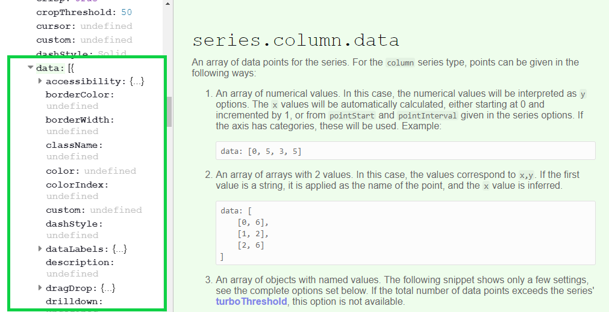

```{r setup, include=FALSE}

library(highcharter)
library(tidyverse)
library(ggplot2)
library(nbastatR)
library(forecast)
library(lubridate)
knitr::opts_chunk$set(echo = TRUE, warning = FALSE, message = FALSE)
```

## Overview

### What

`highcharter` is an R implementation of the highcharts javascript graphing API through R's `htmlwidgets`. Most of the highcharts functionality is implemented through `highcharter` however the documentation is a little light. This guide will provide examples on how to create and customise various graphs whilst providing some tips on how to think about the package that will help you build and debug your more ambitious charts. I'll try to show and explain (to the best of my knowledge) the most common graphs and customisation options I use in my day-to-day work. I assume you're familiar with creating simple `ggplot` graphs and mapping data to chart dimensions using the `aes()` function.

Highcharts is a commercial product so you can't add these charts to a commercial product (selling to customers) without purchasing a licence but non commercial use (internal organisation / research) comes under their free license.

Your most important resources should be the `highcharter` official website, and the highcharts api documentation which you should bookmark in your browser:

* [Highcharter Official Website](http://jkunst.com/highcharter/)
* [Highcharts API Documentation](https://api.highcharts.com/highcharts/)

As you become more a more proficient `highcharter` user and your charting requirements become more complicated you will need to understand more about the complexities of the highcharts API and you might need to learn, read and write a little javascript. This learning curve is actually the best thing about highcharter: most basic charts are as easy to create as `ggplot`, whilst complex and beautiful charts are still achievable with enough thought and tinkering.

### When & Why

`highcharter` is a perfect compliment for `ggplot2`. Depending on your needs you it might not completely replace your use of that library, but it may. `ggplot` has a number of functional advantages over highcharter as it has simple implementations of reasonably complex chart types. I'd say I use `highcharter` for 90% of my day to day plots.

If you need to do any of the following or you're a gun at making ggplots look presentable it's I'd suggest using `ggplot`:
* Semi-complicated facetting
* Standard statistical layers / geoms like smooths and confidence intervals / error bars etc.

### Getting The Data

I'll be illustrating `highcharter` functionality with an NBA dataset I'll get from the `nbastatR` package.

We'll use the gamelogs (boxscores) from the most recent complete NBA season 2018-19:

```{r, warning=FALSE, message=FALSE}
gamelogs = game_logs(seasons = 2019)
```

## Basic Charts

### Tidy Data & ggplot2

Most (~90%) of your day-to-day charts can be probably written with 2-3 lines of code using the `hchart` and `hcaes` functions. These functions allow you to use the extremely powerful grammar of graphics to turn R data into interactive charts - functionality that isn't implemented natively in R `plotly` for example. Like `ggplot2` your data needs to be in tidy / long format so you'll need to be using `tidyr` for some simple data pivotting before passing it to your highchart functions.

A simple `ggplot` of the top 10 scorers in the NBA this year might look like the following:

```{r message=FALSE, warning=FALSE}
gamelogs %>%
  group_by(namePlayer) %>%
  summarise(ppg = mean(pts)) %>%
  arrange(desc(ppg)) %>%
  slice(1:10) %>%
  ggplot(aes(x = namePlayer, y = ppg)) +
  geom_col()
```

This chart (let's be honest here) looks awful. I personally think ggplot needs to do a better job of creating pleasing default charts and themes to entice beginners. Not to mention that ggplot has chosen to alphabetize the players on the x-axis even though i specifically ordered the dataframe in descending points per game order, a reasonbaly challenging workaround is needed for an R beginner. Highcharter, on the other hand, creates readable, nice looking default charts that can be presented naturally in a widely used publishing format (a html page).

Here's the highcharter version of this plot:

```{r}
gamelogs %>%
  group_by(namePlayer) %>%
  summarise(ppg = mean(pts)) %>%
  slice(1:10) %>%
  hchart("column", hcaes(x = namePlayer, y = ppg))
```

There are many chart types available in higcharts which you can see [here](https://api.highcharts.com/highcharts/series) however, I'll go through simple calls for the most common chart types.

### Column

```{r}
gamelogs %>%
  group_by(namePlayer) %>%
  summarise(apg = mean(ast)) %>%
  arrange(desc(apg)) %>%
  slice(1:10) %>%
  hchart("column", hcaes(x = namePlayer, y = apg)) %>%
  hc_title(text = "Assists Per Game")
```

### Bar

```{r}
gamelogs %>%
  group_by(namePlayer) %>%
  summarise(apg = mean(ast)) %>%
  arrange(desc(apg)) %>%
  slice(1:10) %>%
  hchart("bar", hcaes(x = namePlayer, y = apg)) %>%
  hc_title(text = "Assists Per Game")
```

### Scatter

```{r}
gamelogs %>%
  group_by(namePlayer) %>%
  summarise(orebpg = mean(oreb), drebpg = mean(dreb), trebpg = mean(treb)) %>%
  arrange(desc(trebpg)) %>%
  slice(1:30) %>%
  hchart("scatter", hcaes(x = drebpg, y = orebpg)) %>%
  hc_title(text = "Off. Rebounds vs Def. Rebounds")
```

### Bubble

```{r}
gamelogs %>%
  group_by(namePlayer) %>%
  summarise(orebpg = mean(oreb), drebpg = mean(dreb), trebpg = mean(treb)) %>%
  arrange(desc(trebpg)) %>%
  slice(1:30) %>%
  hchart("scatter", hcaes(x = drebpg, y = orebpg, size = trebpg)) %>%
  hc_title(text = "Off. Rebounds vs Def. Rebounds")
```

### Line

```{r}
gamelogs %>%
  filter(namePlayer == "Luka Doncic") %>%
  hchart("line", hcaes(x = numberGamePlayerSeason, y = pts)) %>%
  hc_title(text = "Luka Doncic Points")
```

### Spline

Splines have smoothed edges

```{r}
gamelogs %>%
  filter(namePlayer == "Luka Doncic") %>%
  hchart("spline", hcaes(x = numberGamePlayerSeason, y = pts)) %>%
  hc_title(text = "Luka Doncic Points")
```

### Area

```{r}
gamelogs %>%
  filter(namePlayer == "Jonathan Isaac") %>%
  arrange(numberGamePlayerSeason) %>%
  mutate(blocks = cumsum(blk)) %>%
  hchart("area", hcaes(x = numberGamePlayerSeason, y = blocks)) %>%
  hc_title(text = "Jonathan Isaac Blocks")
```

There is an areaspline (smoothed edges) too.

## Understanding The API

The most important thing to learn about this package is how the relatively undocumented R functions map onto the actual `highcharts` javascript library. The way these `htmlwidgets` packages work is consuming R dataframes and R instructions and turning them into the javascript code, that when embedded into your output html page, will display the particular chart you wanted to create.

Once you understand this concept you'll no longer be limited by the package documnetation, or Josh Kunst's highcharter showcase website. You'll be able to build many, many different charts with near unlimited customisation.

To illustrate how to write R highcharter code from just the javascript API docuementation we'll isolate a relatively simple component: a chart's y axis.

### A Simple Example

To customise a highcharter y axis you need to use the `hc_yAxis()` function. Let's have a look at the documentation for that function.

```{r, eval=FALSE}
help(hc_yAxis)
```


There is some example customisation supplied in the exaples which can be very helpful, but is still limited to a few examples. It might not click with you immediately what's required or valid as an input for the `hc_yAxis()` function. How do I know what arguments I can use for this function? Well the answer is always the API documentation. Let's check the actual highcharts API documentation for a highcharts y Axis. You can find it yourself [here](https://api.highcharts.com/highcharts/yAxis) but it looks like this:


The arguments in the green rectangle (there are more than shown) is an exhaustive list of the customisation options for a highcharts y Axis. There are nearly 50 different arguments for a y axis that will change the way your charts looks or works, and you can use any of them (provided highcharter stays up to date) in your R function calls. 

The highcharts javascript API is expecting a JSON packet to define all y axis options. That is some options are single strings, some are booleans TRUE / FALSE, some are numbers. But some are arrays of numbers or strings and some are more JSON packets. Highcharter will make conversion provided you supply the options as an appropriately structured and named R list. 

#### Simple Arguments

Starting simply using one of the simple boolean chart options if we set `gridLineWidth` to 10 it will make the major grid lines to be massive and ugly:

```{r}
gamelogs %>%
  group_by(namePlayer) %>%
  summarise(apg = mean(ast)) %>%
  arrange(desc(apg)) %>%
  slice(1:10) %>%
  hchart("column", hcaes(x = namePlayer, y = apg)) %>%
  hc_title(text = "Assists Per Game") %>%
  hc_yAxis(gridLineWidth = 10)
```


#### Nested Arguments

Your most common form of axis customisation will be probably be the title and labels on the axis. Here's the documentation for a Y axis title


Notice the dropdown icons and nested arguments. They tell us that the axis title should be defined by it's own JSON packet within the broader y Axis configuration. Further any styling you want to add to the title should be another JSON packet (we'll get to this part next). To correctly create this JSON packet in R we use named lists. 

When using the documentation all you should think is when I see a nested JSON packet with a dropdown marker / open curly braces I need to start a new R list.

```{r}
gamelogs %>%
  group_by(namePlayer) %>%
  summarise(apg = mean(ast)) %>%
  arrange(desc(apg)) %>%
  slice(1:10) %>%
  hchart("column", hcaes(x = namePlayer, y = apg)) %>%
  hc_title(text = "Assists Per Game") %>%
  hc_yAxis(
    endOnTick = FALSE,
    title = list(
        text = "Assists Per Game",
        align = "high", # Documentation says options are: low, middle or high
        margin = 10 # Number of pixels between the title and the axis line
    )
  )
```

It's as simple as that. Any argument listed in the highcharts API documentation, whether it's a simple string or number or another nested JSON packet, can be inserted into the appropriate R function call using the right syntax. Failure to name the arguments properly or nest the options appropriately won't cause a fatal error - the options just won't be successfully added to the chart (this can be frustrating debugging at times tbh).

#### Style (CSS)

The style argument is a special case on many highcharts components. In the documentation for yAxis above, only color is listed as an option but it's not nearly the only option. If you've done a little bit more web coding you'll know that what it's referring to is CSS style. Any CSS property can be added to a highcharter component that has this style argument. In this case we'll be defining the CSS properties to adjust on the chart title. A list of CSS properties can be found [here](https://www.w3schools.com/cssref/).

What to watch for here is that CSS properties are often hyphenated words (like `font-weight`) which won't play perfectly nicely in R lists so you should define properties in your R lists with camel case version of these property names (eg. `fontWeight`). As an example we'll make the chart title bold, slightly larger and the color of the columns like so:

```{r}
gamelogs %>%
  group_by(namePlayer) %>%
  summarise(apg = mean(ast)) %>%
  arrange(desc(apg)) %>%
  slice(1:10) %>%
  hchart("column", hcaes(x = namePlayer, y = apg)) %>%
  hc_title(text = "Assists Per Game") %>%
  hc_yAxis(
    endOnTick = FALSE,
    title = list(
        text = "Assists Per Game",
        align = "high", # Documentation says options are: low, middle or high
        margin = 10, # Number of pixels between the title and the axis line
        style = list(
            fontWeight = "bold",
            fontSize = '1.4em', # 1.4 x tthe size of the current text
            color = "#7cb5ec" # Hex code for the default blue
        )
    )
  )
```

### Chart Data

Not only are the various chart features understandable and configurable from referencing the javascript API documentation but the data itself (the mapping between R dataframe rows and columns to highcharts data structures you normally just let `hchart()` do on your behalf) is understandable in the same way. 

Building your own nested lists to bypass the normal `hchart()` approach is a very useful tool to have at your disposal but is overkill for 99% of charts that can be built with a simpler approach. It is, however, helpful to understand and if you want to make highly bespoke charts you'll probably need to understand how this works.

#### Columns

Let's check the API documentation for a column graph. We'll find the specification for each chart type under the `series >` sub header.

The specification looks like the following



What we're interested in is the `series > column > data` entry which tells us the viable formats to enter the data for a column chart. The documentation says we can enter the data in 3 different ways:

1. A simple array of numerical values
2. A array of arrays with x, y value pairs
3. An array of objects with JSON packets defining a single data point

Let's try to implement the assists chart in each of these 3 ways but without the help of `hchart()`

#### Option 1: Simple Array

The first option says data can be presented as a simple array of values. When we see JSON "array" we should generally think of R lists but sometimes an R vector works too. 

To build a highcharter chart without `hchart()` we need to do it in 2 steps: instantiate a highcharter plot with `highchart()` and then add data and chart type with `hc_add_series()`.

```{r}
assists = 
  gamelogs %>%
  group_by(namePlayer) %>%
  summarise(apg = mean(ast)) %>%
  arrange(desc(apg)) %>%
  slice(1:10)

apg = assists %>% pull(apg)
nammePlayer = assists %>% pull(namePlayer)

highchart() %>%
hc_add_series(
  type = "column",
  data = apg
)
```

So it worked, but given we only passed the chart the assist / game data series it doesn't know what players the values correspond to or anything. We can add these by specifying axis "categories":

```{r}
highchart() %>%
hc_add_series(
  type = "column",
  data = apg
) 
# hc_xAxis(categories = namePlayer)
```

#### Option 2: Array of Arrays

So this option suggests you can provide the data as an array of x, y pairs. This isn't a perfectly natural data structure for R but we can construct a list of x, y pairs from a dataframe with the help of the `list_parse()` function exported with highcharter.

First let's hardcode an example dataseries to see what the data looks like in R:


```{r}
highchart() %>%
 hc_add_series(
   type = "column",
   data = list(
     list("Russell Westbrook",10.5),
     list("John Wall", 8.7),
     list("Kyle Lowry", 8.6)
   )
 )
```

Notice that the x values haven't been placed on the x Axis but rather appear as the "name" of the column when you hover over it.

said when you see array you should think R vector but that doesn't quite work here. What we can create though is a list of 2 R vectors like this:

```{r}
 assists =
   gamelogs %>%
   group_by(namePlayer) %>%
   summarise(apg = mean(ast)) %>%
   arrange(desc(apg)) %>%
   slice(1:10)

 apg = assists %>% pull(apg)
 namePlayer = assists %>% pull(namePlayer)

 highchart() %>%
 hc_add_series(
   type = "column",
   data = list(
     list("Tom",2),
     list("Hannah",3)
   )
 )
```

#### Array of Objects

So here

```{r}
 # assists =
 #   gamelogs %>%
 #   group_by(namePlayer) %>%
 #   summarise(apg = mean(ast)) %>%
 #   arrange(desc(apg)) %>%
 #   slice(1:10)
 # 
 # hcDF =
 #   assists %>%
 #   mutate(x = 1:n()) %>%
 #   rename(
 #     x = namePlayer,
 #     y = apg
 #     #name = namePlayer
 #   )
 # 
 # highchart() %>%
 # hc_add_series(
 #   type = "column",
 #   data = list_parse(hcDF)
 # )
```


## Pre-Baked `hchart()` for different R classes

One of the awesome features Josh Kunst has built into highcharter is that, with some black box magic, `hchart()` supports charting of various standard R objects / classes out of the box.

The github page currently says this function current supports: numeric, histogram, character, density, factors, ts, mts, xts, stl, ohlc, acf, forecast, mforecast, ets, igraph, dist, dendrogram, survfit classes.

To see how this works lets have a look at a few examples of the functionality that i use regularly. This gamelog dataset doesn't lend itself to some of these classes so I won't show them all.

### Histograms

I want to view histograms or density plots of numeric vectors very regularly. This is a simple one liner in highcharter

```{r}
gamelogs %>% pull(pts) %>% hchart()
```

hchart() has been passed a simple numeric vector here (the points scored by players in all 19-20 NBA games), and decided that the appropriate plot is a histogram. Like other highcharts it is a highcharts object that supports the normal layering and customisation so we can add a few lines to makes the chart more readable:

```{r}
gamelogs %>% pull(pts) %>% 
  hchart(name = "Player Points") %>%
  hc_xAxis(title = list(text = "Points Scored")) %>%
  hc_yAxis(title = list(text = "# times acheived")) %>%
  hc_title(text = "19-20 Box Score Points")
```

### Densities

Similarly if we were interested in this plot but in a density form (smoothed & proportion of total cases) we can simply pass hchart() a density object created by the base density() function

```{r}
gamelogs %>% 
  pull(pf) %>% 
  density() %>%
  hchart(name = "Player Fouls") %>%
  hc_xAxis(title = list(text = "Fouls")) %>%
  hc_yAxis(title = list(text = "% of time acheived")) %>%
  hc_title(text = "19-20 Box Score Fouls")
```

### Character / Factor Counts

Like the numeric vector example suppling hchart() with a character vector or factor vector will create a plot of the value counts within the vector.

```{r}
gamelogs %>% pull(slugTeamWinner) %>% hchart(name="Total Winning Games Per Player")
```

### Forecast

To show a more elaborate implementation a forecast created with the forecast package is plotted automatically as follows

```{r}
gamelogs %>%
  filter(namePlayer == "Al Horford") %>%
  select(pts) %>%
  slice(1:60) %>%
  ts() %>%
  forecast() %>%
  hchart()
```

### Correlation Matrix

Plotting a correlation matrix from a base R correlation analysis is also simple and easy. Notice the huge presentation and clutter advantage of interactivity for a chart type like this.

```{r}

gamelogs %>%
  select(pts, minutes, treb, dreb, oreb) %>%
  cor() %>%
  hchart()
```

## Components + Style

Adding the right components and style to charts is my #1 rule for data visualisation. It's your job as the visualiser to make a chart that is clear, easy to understand, and purposeful. Too many charts are presented without labels, descriptions, units or fail to convey a message or conclusion and it's a crime (not a real crime I guess, but a chart crime). Making your chart clean and aesthetically appealing is also a hugely underated job and has huge impact on how much effort your viewer will spend trying to absorb your charts message.

This is where highcharter really shines over some of it's htmlwidget & static competitors.

### Axes

Adding titles, units


```{r}
# gamelogs %>% 
#   group_by(namePlayer) %>%
#   mutate(
#     teamWinPct = mean(ifelse(outcomeGame == "W", 1, 0)),
#     above500 = ifelse(teamWinPct > 0.5, "> 500", "< 500")
#   ) %>%
#   ungroup() %>%
#   group_by(namePlayer, above500, isB2BSecond) %>%
#   summarise(
#     makes3 = sum(fg3m),
#     attempts3 = sum(fg3a)
#   ) %>%
#   ungroup() %>%
#   mutate(pct3pt = makes3 / attempts3) %>%
#   select(-makes3, -attempts3) %>%
# 
#            
#            
#            
#            
#            
#            
#            )
#   hchart("scatter")
#   select(namePlayer)
#   group_by(namePlayer) %>%
#   summarise(points = sum(pts)) %>%
#   arrange(desc(points)) %>%
#   slice(1:10) %>%
#   hchart("column", hcaes(x = namePlayer, y = points)) %>%
#   hc_yAxis(title = list(text = "Total Points")) %>%
#   hc_xAxis(title = list(text = "Player Name"))
```

*Units / Formatting*

You should always display units in the most human readable way you know. Adding comma seperators to large

### Titles

highcharts have a title and a subtitle element which you can set like following

```{r}
gamelogs %>% 
  group_by(namePlayer) %>%
  summarise(points = sum(pts)) %>%
  arrange(desc(points)) %>%
  slice(1:10) %>%
  hchart("column", hcaes(x = namePlayer, y = points)) %>%
  hc_title(text = "2018-19 Scoring") %>%
  hc_subtitle(text = "Total points by individual player")
```

### Plot Area


There's a number of things you might notice about this chart and how it differs from it's ggplot counterpart.

* 
* t thing is that if you can interact with it; hover over it to see a (relatively ugly) tooltip. Second is that it's dynamic, which you'll notice initially because there are more bars (star wars characters) than there are labels on the y-axis. To see an exaggerated version of this reduce the width of your browser window to see the chart react and replot as it tries to estimate the best way to present the data without it looking busy and cluttered; the number of characters shown on the y-axis will keep decreasing.

This is normally a great and useful feature of highcharts but it's something to keep track of as you plot.

### Default charts

#### hchart()

The `hchart()` function is kind of an amazing function that has been written to create immediate logical graphs from various types of R objects. `hchart()` will detect the R object type and decide the best way to plot it. Here are some examples. Notice that the function call is exactly the same `hchart([object])` but the plot that's produced is very different.

Various other object types are supported which you can find [here](http://jkunst.com/highcharter/hchart.html)

### Numeric Vector :: Histogram

```{r}
starwars %>%
  pull(mass) %>%
  hchart(name = class(.))
```


### Density Object :: Density Plot

```{r}
starwars %>%
  filter(!is.na(mass)) %>%
  pull(mass) %>%
  density() %>%
  hchart(name = class(.))
```


### Forecast Object :: Timeseries / Forecast Chart

```{r}
storms %>%
  filter(name == "Emily") %>%
  pull(wind) %>%
  forecast() %>%
  hchart(name = class(.))
```

## Advanced Charts


### Showcase: Donut Tooltip

Let's try to replicate Josh Kunst's awesome donut / scatter plot but with NBA data. I'll try to talk through the logic here.


```{r}
gamelogs %>%
  group_by(namePlayer) %>%
  filter(sum(pts) >= 2000) %>%
  group_by(namePlayer) %>%
  arrange(dateGame) %>%
  mutate(ptsCumulative = cumsum(pts), game_number = 1:n()) %>%
  select(namePlayer, ptsCumulative, game_number) %>%
  hchart("line", hcaes(X = game_number, y = ptsCumulative, group = namePlayer))


```


